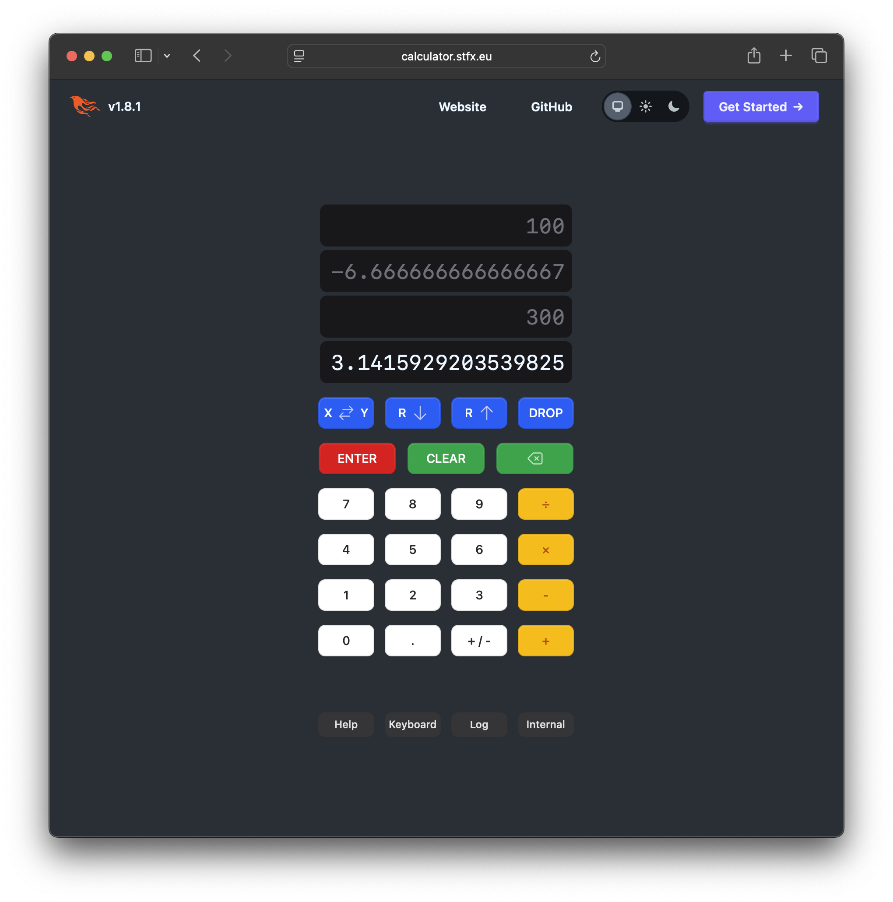

# rpn_calculator

An RPN Calculator written using Elixir Phoenix LiveView and Fluxon UI

You can try the [Live Demo](https://calculator.stfx.eu) yourself.

## Implementation

### rpn_calculator.ex

The model is defined in [rpn_calculator.ex](lib/rpn_calculator/rpn_calculator.ex).
This is a struct that acts as a state machine.
Each key constitutes a transition from one state to the next.

During number input, `input_digits` is a string containing the characters of the input,
while the top of the `rpn_stack` (called X) is equal to the number itself as parsed from the input.

While number input is in progress, `computed?` will be false.

Mathematical operations, like addition or multiplication,
and stack manipulations, like enter or drop, work on the `rpn_stack` itself.

Afterwards they show the value of X in the display,
and `computed?` will be true.
Input editing is ended by operations or manipulations.

Backspace removes the last input digit.
Clear removes all input digits,
and when there are no input digits, removes the whole stack.

Division by zero is not allowed.

### calculator.ex

The UI is defined in [rpn_calculator.ex](lib/rpn_calculator_web/live/calculator_live/calculator.ex).
This is a Phoenix LiveView that renders based on the state of its model.
Keys, both buttons and keyboard keys, are sent to the model.

The panel at the bottom show help, a keyboard shortcut table,
a log of all keys entered and a look at the internal model.
